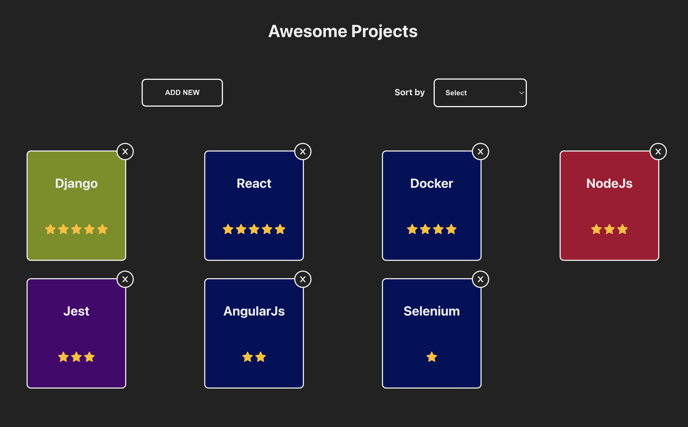
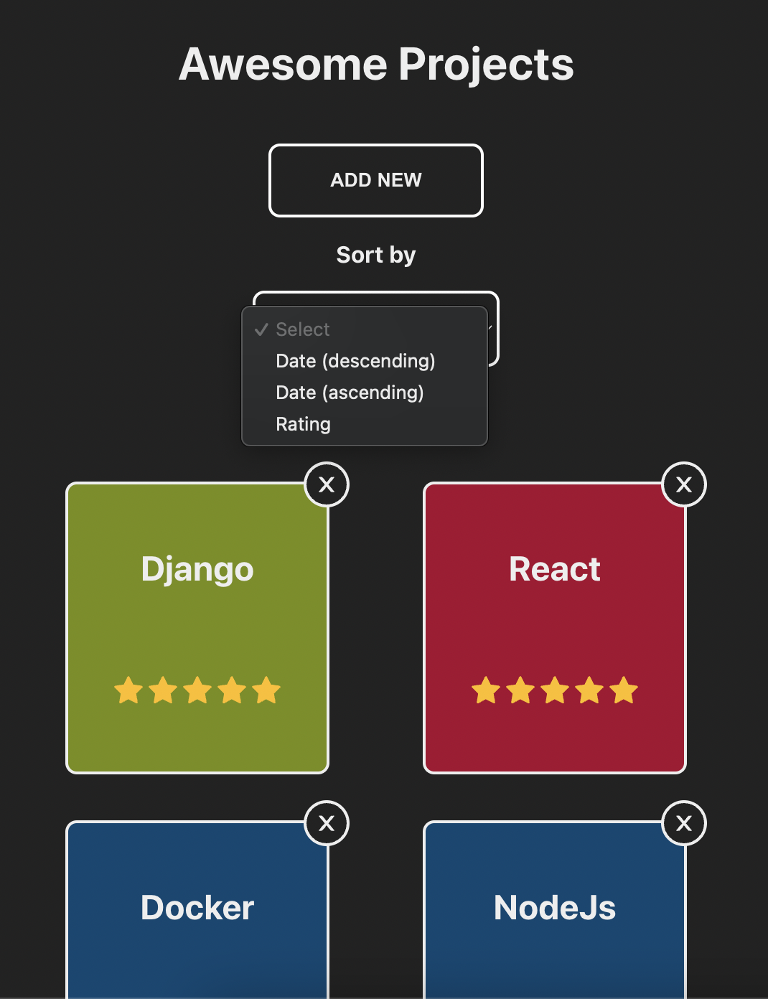
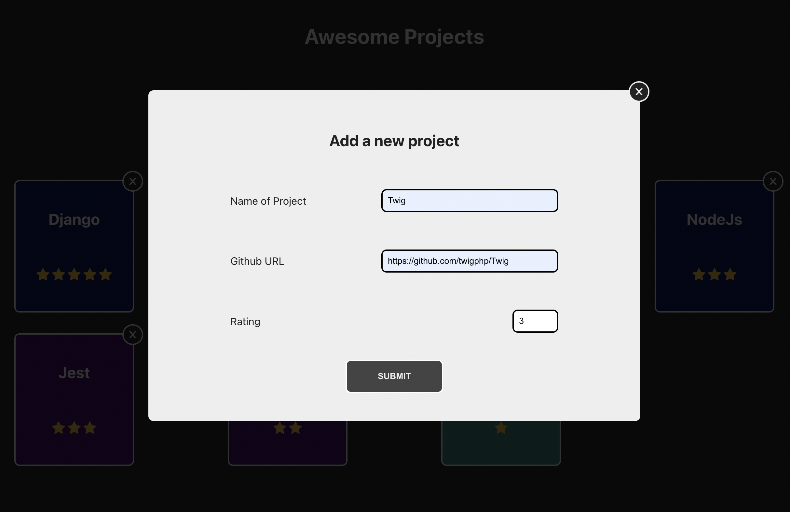
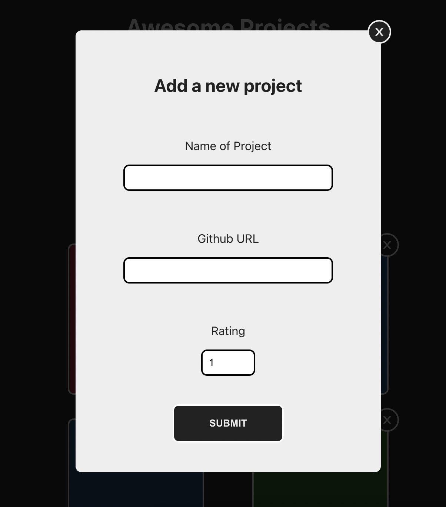

# Github Projects

This is a project displaying Github projects in a grid where the user can add a new project, remove them and sort them based on rating or date (ascending and descending order)

## Technology and libraries used

- React & TypeScript
- Framer Motion for animating the order of cards when sorted
- Uuid for generating a random id for new added projects
- Local storage used for storing the projects in the browser and to have new list available after page reload
- React Icons for close and star icons

## File structure

- Data folder includes some default projects given and a list of colors used for randomizing the background color for cards
- Components are separated to their own folders including the .tsx file and .css file for styling

## Usage

### Run the project locally

- Navigate to the project folder (can vary depending where you put the project folder)

```shell
cd github-projects
```

- Run the project locally -> opens the browser on localhost:3000

```shell
npm start
```

## Screenshots





